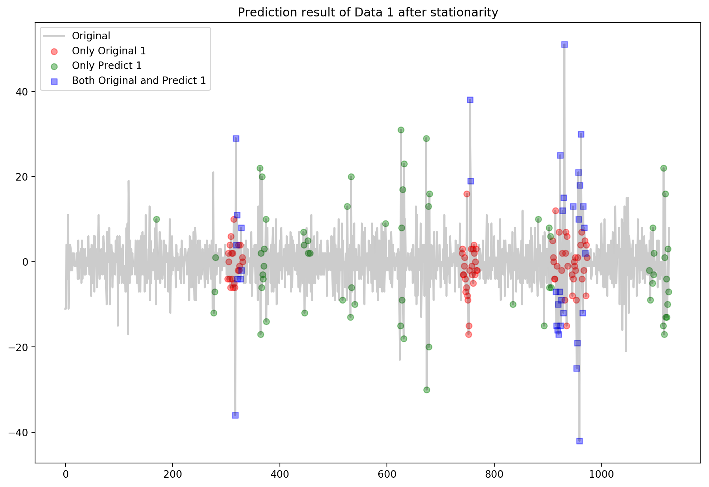
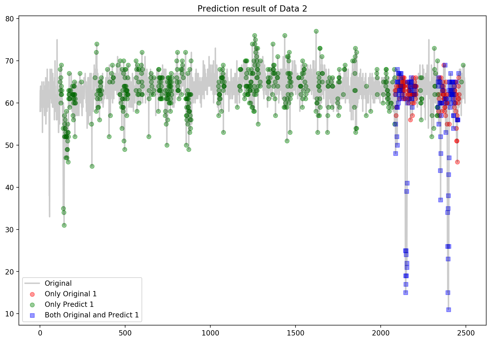
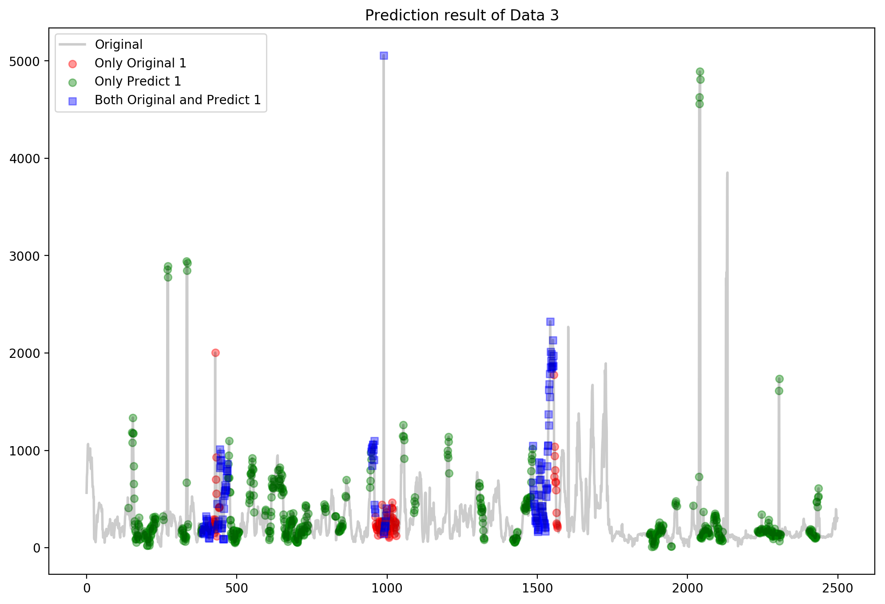
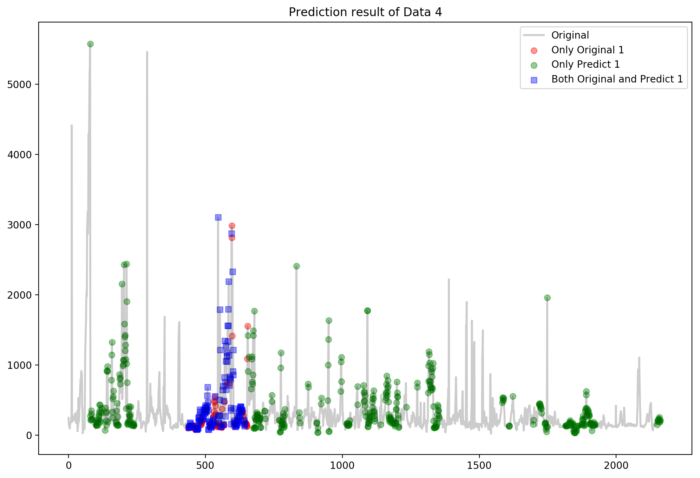

### 带时间窗保护机制的Conformal Anomaly Detector

项目结构：

```shell
├── alg # 算法核心实现
│   └── conformal_anomaly_detector.py
├── data # 源数据文件
│   ├── htmjava_TravelTime_387_withlabel.csv
│   ├── htmjava_TravelTime_451_withlabel.csv
│   ├── htmjava_speed_7578_withlabel.csv
│   ├── htmjava_speed_t4013_withlabel.csv
│   └── preprocessed/ # 平稳处理后的数据文件
├── model # 代码
│   ├── analysis.py # 分析实验结果
│   ├── explore.ipynb # 探索性分析
│   ├── model.py # 总入口
│   └── preprocess.py # 平稳处理
├── readme.md # 本说明文档
├── result # 生成的结果文件
│   ├── mse_False.csv # mse得分结果，False表示不加平稳
│   ├── mse_True.csv # mse得分结果，True表示加平稳
│   ├── pics # 所有图片结果文件
│   │   ├── Decomposition/ # 做季节性分解的图片结果
│   │   ├── Diffed/ # 做一阶差分平稳的图片结果
│   │   └── Predict/ # 预测效果图片
│   └── pred/ # 预测结果，False表示不加平稳，True表示加
└── util（辅助功能）
    └── log.py
```


###  1  原理

Conformal Anomaly Detector是序列检测中点异常类型预测的方法，**直观来看，要检测一个新观测点$x_t$是否异常，那就计算加入这个$x_t$的当前序列子段与前面相邻的序列子段差异是不是大，如果差异大，应该是这个新加入的$x_t$导致的，也就是说$x_t$异常。这个方法巧妙地借助子段来判断（新加入）点。**

但是在具体实现上，怎么确定前面的相邻序列子段（Q1），差异大是怎么定义的（Q2），异常得分怎么给出（Q3）都没展开介绍，下面我们给出具体的步骤。

- 第一步

已知$x_t$，可以构造一个如下的L行、M列的矩阵Z。每列都是一个序列子段，一共M个子段，每个子段的维度是L，相邻子段之间应该差别不大。这个矩阵，理解起来，就是通过$x_t$前面的L+M-1个序列点，每次滑动1个序列点得到。这就是我们确定前面的相邻序列子段的方法（Q1）。
$$
Z=\left[\begin{array}{cccc}
x_{t-M-L+1} & x_{t-M-L+2} & \cdots & x_{t-L} \\
x_{t-M-L+2} & x_{t-M-L+3} & \cdots & x_{t-L+1} \\
\vdots & \vdots & \ddots & \vdots \\
x_{t-M} & x_{t-M+1} & \cdots & x_{t-1}
\end{array}\right]
$$

- 第二步

我们将矩阵$Z$按列划分为两个矩阵，$Z$的前$T$列$Z_T$作为训练矩阵，$Z$中剩下的列形成的矩阵$Z_C$称为校准矩阵。然后计算$Z_C$中每列对应的向量$Z_C^l$到矩阵$Z_T$的距离$a_l$，共有$C=M-T$个这样的距离值，还计算新观测点$x_t$加入得到的序列子段向量$z=(x_{t-L+1},\cdots,x_t)$到矩阵$Z_T$的距离$a$。

最终的异常分数$p_t$是结合距离值$a$和$C$个距离值$a_l$综合给出，直观想法是，若最终子段$z$比校准矩阵中的所有子段（即列）到训练矩阵都远，那就说明这个最终子段差异很大了。这就是我们定义的差异大（Q2），具体的差异概率（Q3）公式如下：
$$
p_{t}=\frac{\left|i=1, \ldots, C: a^{i}<a\right|}{C}
$$

- 第三步

无论是$a_l$还是$a$，我们都要计算一个向量到一个向量集合的距离，这可以转化为单一向量到集合中每个向量的距离之和，但是因为向量集合中向量数量太多，而且与待求单一向量距离太远的集合中的向量意义不大，所以我们只选集合中k个与单一向量最近的向量的距离进行求和。

实现时，距离定义可以自己设定，求邻居的结构也可使用KD树、球树结构等。下面给出计算一个向量$o$到一个向量集合$Y$的距离$NCM(o,Y)$的定义：
$$
N C M(o, Y)=\sum_{h \in knn(o, Y)} \operatorname{dist}(o, h)
$$
其中$knn(o,Y)$为集合$Y$中与$o$最近的$k$个向量组成的集合，$dist(o,h)$表示向量$o$和向量$h$的距离。

那么，如果$Z_C^l$表示$Z_C$的第$l$列，$Z_C$中每列对应的向量$Z_C^l$到矩阵$Z_T$的距离$a^l$定义如下：
$$
a^{l}=N C M\left(Z_{C}^{l}, Z_{T}\right)
$$
新观测点$x_t$加入得到的序列子段向量$z=(x_{t-L+1},\cdots,x_t)$到矩阵$Z_T$的距离$a$定义如下：
$$
a=N C M\left(z, Z_{T}\right)
$$


### 2  代码实现

#### **（1）Conformal Anomaly Detector算法实现 `conformal_anomaly_detector.py`**

代码中字母表示与1原理一致。实现细节上，我们使用knn计算邻居是借助sklearn.neighbors._ball_tree中的BallTree，因为我们L选的数字一般较大，超过20，而L也就是向量的维度，所以knn要处理的是高维向量。那么，结合已掌握的知识，为了效果和速度，用球树合适快速求出邻居。

```python
class Conformal(object):
    # 超参L和M需要调节
    def __init__(self, L=40, M=20):
        self.L = L  # 因为L大于20，所以knn用的球树
        assert self.L >= 20, "L要大于20，knn才用的球树"
        self.M = M
        self.T = int(self.M * 0.6)
        self.C = self.M - self.T
        self.k = int(self.T * 0.5)

    # 预测一个新观测点x_t的异常概率p_t
    def pred(self, t, x):
        x_t = x[t]
        Z = np.zeros((self.L, self.M), dtype=np.int16)

        for l in range(self.M):
            Z[:, l] = x[t - self.L - self.M + 1 + l:t - self.M + 1 + l]

        Z_T = Z[:, :self.T]
        Z_C = Z[:, self.T:]
        a = np.zeros(self.C)

        def NCM(o, Z_T):
            Y = np.c_[o, Z_T]
            tree = BallTree(Y.T, leaf_size=3) # 球树
            dist, ind = tree.query(Y.T[:1], k=self.k + 1)
            return dist.sum()

        for l in range(self.C):
            o = Z_C[:, l]
            a[l] = NCM(o, Z_T)

        z = x[t - self.L + 1:t + 1]
        assert z[-1] == x_t, "新观测点错误"
        a_t = NCM(z, Z_T)
        p_t = (a - a_t < 0).astype(int).sum() / self.C
        return p_t
```

使用时，首先初始化类`Conformal`，应根据数据特性给出超参L和M的值，建议L>20，M是L的0.5~0.6倍。  然后使用`Conformal.pred()`来预测新观测点$x_t$的异常概率$p_t$。


#### **（2）时间窗保护机制**

因为原始的Conformal Anomaly Detector算法是适合检测时间序列中的点异常，而本次任务中4个数据的异常都是子序列异常，所以需要适当修改原算法才能有好的效果。

首先我们考虑到当发生异常后，随后的正常子段在与异常子段计算距离时，肯定距离偏大，所以会导致异常子段后面的一段正常子段也被检测为异常，所以我们设置保护期，protect存放被保护的新点们的下标。

```python
protect = []  # 保护期
terrible_length = cad.L if cad.L > 50 else int(cad.L * 0.8)
protect_length = cad.L * 4
```

- 当不在保护期内时，计算保护期

当$x_t$不在保护期内，那么计算从当前t下标往前terrible_length长度的所有连续点是不是都被检测为异常，如果是，那么从t往后protect_length长度的点都被保护为正常。

```python
is_protect = 0
for idx in range(terrible_length):
    if data.loc[t - 1 - idx, "pre_label"] == 0:
        break
    else:
        is_protect = is_protect + 1
if is_protect == terrible_length:
    protect = [t + x for x in range(protect_length)]
```

- 当处于保护期，$x_t$的pre_label一定为0，且异常概率计算公式也修改，新检测点离异常区越远异常概率越小

```python
p_t = 0.4 * (1 - ((t - min(protect)) / protect_length)) * (1 - threshold)  # 越远就可能性越小
```


#### **（3）进行平稳预处理 `preprocess.py`**

还是因为原始的Conformal Anomaly Detector算法是适合检测时间序列中的点异常，如果我们将当前时间序列的季节性去掉，变换成一个随机波动的时间序列，那么点异常检测方法就能用来检测子序列异常了。为了进行转换，下面我们进行平稳预处理。

用`statsmodels.tsa.seasonal`中的`seasonal_decompose`包来先大致查看分解情况，然后进行平稳处理尝试，这里用的是一阶差分就平稳成功。

```python
# 粗略查看默认分解情况
decomposition = seasonal_decompose(data['value'], freq=freqs[csv_i])
decomposition.plot()
plt.savefig(f'../result/pics/Decomposition/{csv_i + 1} Decomposition.png', dpi=200, bbox_inches='tight')
# 平稳处理测试
data['value_diff1'] = data['value'].diff(1).fillna(method='bfill').astype('int')
test_stationarity(data, freqs[csv_i], names[csv_i])
```

下图是1号数据decomposition的结果示例，因为最终只有1号数据进行平稳预处理后得分有变好，所以这里只展示1号数据。


测试平稳效果的函数，结果是都通过了检验。

```python
def test_stationarity(data, window_num, name):
    timeseries = data['value_diff1']
    # Determing rolling statistics
    rolmean = timeseries.rolling(window=window_num).mean()
    rolstd = timeseries.rolling(window=window_num).std()

    # Plot rolling statistics:
    fig = plt.figure(figsize=(16, 8))
    orig = plt.plot(timeseries, color='blue', label='Original', alpha=0.2, linewidth=2)
    mean = plt.plot(rolmean, color='red', label='Rolling Mean')
    std = plt.plot(rolstd, color='green', label='Rolling Std')
    plt.legend(loc='best')
    plt.title(f'First Difference of {name}')

    # 在图上标注平稳性信息
    dftest = adfuller(timeseries, autolag='AIC')
    dfoutput = pd.Series(dftest[0:4], index=['Test Statistic', 'p-value', '#Lags Used', 'Number of Observations Used'])
    for key, value in dftest[4].items():
        dfoutput['Critical Value (%s)' % key] = value
    dfoutput['Window Length'] = window_num
    plt.text(1.08 * len(timeseries), 0, f'Results of Dickey-Fuller Test:\n'
                                        f'{dfoutput}'
                                        f'\n\nConclusion:'
                                        f'\np-value < 0.05, Test Statistic < Critical Value (1%)\nTherefore, the time series is stable after first-order difference.')
    # 保存图片
    plt.savefig(f'../result/pics/Diffed/{csv_i + 1} First Difference.png', dpi=200, bbox_inches='tight')
```

下图是4个数据的平稳性检测结果，结论在图中右侧用文字标出，都通过了检验。


那么，我们在用带时间窗保护机制的Conformal Anomaly Detector算法时，分别尝试使用平稳前和平稳后的数据。


#### **（4）整体框架 `model.py`**

```python
import pandas as pd
from sklearn.metrics import mean_squared_error
import sys

sys.path.append('../alg/')
import conformal_anomaly_detector

# 超参设置
saved = True  # 是否保存文件
threshold = 0.2


# 预测某个文件的框架
def pred_csv(names, i_csv, paras, use_diff=False):
    data = pd.read_csv(f"../data/preprocessed/{i_csv + 1} preprocessed.csv",
                       dtype={'label': 'int', 'value_diff1': 'int', 'value': 'int'},
                       parse_dates=['timestamp'])
    x = data['value_diff1'].values if use_diff else data['value'].values

    # 预测
    print(paras[0], paras[1], use_diff)
    cad = conformal_anomaly_detector.Conformal(paras[0], paras[1])
    data['cad_score'] = 0  # 默认预测为不异常
    data['pre_label'] = 0  # 默认预测为不异常
    protect = []  # 保护期
    # is_protect = 0
    terrible_length = cad.L if cad.L > 50 else int(cad.L * 0.8)
    protect_length = cad.L * 4
    # 逐行预测每个score
    for t in range(cad.L + cad.M - 1, len(x)):
        # 不在保护期
        if t not in protect:
            # 计算保护期
            is_protect = 0
            for idx in range(terrible_length):
                if data.loc[t - 1 - idx, "pre_label"] == 0:
                    break
                else:
                    is_protect = is_protect + 1
            if is_protect == terrible_length:
                protect = [t + x for x in range(protect_length)]
                print(protect)

            p_t = cad.pred(t, x)
            data.loc[t, "cad_score"] = max(p_t - threshold, 0)  # 将预测出的概率减小threshold，但保证不小于0
            data.loc[t, "pre_label"] = 1 if p_t == 1 else 0
        # 在保护期内（不用计算新保护期了）
        else:
            p_t = 0.4 * (1 - ((t - min(protect)) / protect_length)) * (1 - threshold)  # 越远就可能性越小
            data.loc[t, "cad_score"] = max(p_t - threshold, 0)  # 将预测出的概率减小threshold，但保证不小于0
            data.loc[t, "pre_label"] = 0
    mse01 = mean_squared_error(data.label, data.cad_score)
    mse0 = mean_squared_error(data[data.label == 0].label, data[data.label == 0].cad_score)
    mse_1 = mean_squared_error(data[data.label == 1].label, data[data.label == 1].cad_score)
    # 保存预测结果
    if saved:
        data.to_csv(f"../result/pred/{i_csv + 1}_pred_{use_diff}.csv", index=None, float_format='%.2f')
    return mse0, mse_1, mse01


if __name__ == '__main__':
    names = ['htmjava_speed_7578_withlabel', 'htmjava_speed_t4013_withlabel', 'htmjava_TravelTime_387_withlabel',
             'htmjava_TravelTime_451_withlabel']
    paras_true = [[100, 60], [120, 70], [80, 50], [50, 30]]
    paras_false = [[40, 24], [40, 25], [80, 50], [50, 30]]
    for use_diff in [False, True]:
        result = pd.DataFrame(columns=('data', 'mse0', 'mse_1', 'mse01'))
        result = result.astype({"mse0": float, "mse_1": float, 'mse01': float})
        result['data'] = [1, 2, 3, 4]
        for i in range(len(names)):
            r_i = pred_csv(names, i, paras_true[i] if use_diff else paras_false[i], use_diff)
            print(names[i], r_i)
            result.loc[i, 'mse0'] = r_i[0]
            result.loc[i, 'mse_1'] = r_i[1]
            result.loc[i, 'mse01'] = r_i[2]
        if saved:
            result.to_csv(f"../result/mse_{use_diff}.csv", index=None, float_format='%.3f')
```


#### **（5）重要细节**

- 第一个新观测点前的L + M - 1个点都直接默认异常概率为0，预测标签为正常，即不考虑一开始就异常的情况
- 因为预测的异常概率整体偏大，靠近1，所以人为地将所有预测出的异常概率减小threshold，同时保证不小于0


#### **（6）待改进**

- 平稳处理没真的转换成随机波动的序列，尖端太多


### 3  实验结果

为简化表达，文中我们简称四个文件分别是：

| 简称           | 原文件名                         |
| -------------- | -------------------------------- |
| data1 或 数据1 | htmjava_speed_7578_withlabel     |
| data2 或 数据2 | htmjava_speed_t4013_withlabel    |
| data3 或 数据3 | htmjava_TravelTime_387_withlabel |
| data4 或 数据4 | htmjava_TravelTime_451_withlabel |

指标用mse，我们使用下面三个指标，其中mse_1体现异常检测程度，mse_01则表示综合预测情况，评价算法在某个数据上的效果我们也主要从mse_1和mse_01角度来看。

| 指标   | 含义                   |
| ------ | ---------------------- |
| mse_0  | 真实标签为0的数据的mse |
| mse_1  | 真实标签为0的数据的mse |
| mse_01 | 所有数据的mse          |

#### （1）得分

- 不经过平稳预处理

| data | mse_0     | mse_1     | mse_01    | 最佳参数(L,M) |
| ---- | --------- | --------- | --------- | ------------- |
| 1    | 0.251     | 0.19      | 0.245     | (40, 24)      |
| 2    | 0.262     | 0.225     | 0.258     | (40, 25)      |
| 3    | 0.231     | 0.262     | 0.234     | (80, 50)      |
| 4    | **0.197** | **0.170** | **0.195** | (50, 30)      |

- 经过平稳预处理

| data | mse_0     | mse_1     | mse_01    | 最佳参数(L,M) |
| ---- | --------- | --------- | --------- | ------------- |
| 1    | **0.142** | **0.206** | **0.149** | (100, 60)     |
| 2    | 0.212     | 0.388     | 0.23      | (120, 70)     |
| 3    | 0.176     | 0.326     | 0.191     | (80, 50)      |
| 4    | 0.198     | 0.427     | 0.221     | (50, 30)      |

- 我们希望在保证mse_1较低的前提下，mse_01也能处于较低的得分，根据这样的想法，下面是我们给出的最佳得分。

| data | mse_0 | mse_1 | mse_01 | 是否平稳预处理 |
| ---- | ----- | ----- | ------ | -------------- |
| 1    | 0.142 | 0.206 | 0.149  | 是             |
| 2    | 0.262 | 0.225 | 0.258  | 否             |
| 3    | 0.176 | 0.326 | 0.191  | 否             |
| 4    | 0.197 | 0.170 | 0.195  | 否             |

只有1号数据在平稳处理后效果明显变好，可能因为1号数据的季节性性明显，预处理得当。


#### （2）检测结果

我们通过绘制序列图形来看检测效果，下面4张图分别是4个数据的最佳结果对应图形，x轴是点的index，y轴是value或者一阶差分后的value（Data1），灰色连线是序列值的连线，红色圆点表示真实是1但没被检测出来，绿色圆点表示真实是0却被检测为异常1了，蓝色矩形表示真实是1同时也被检测出来。蓝色多就说明检测成功，绿色多表示误警多，红色多表示漏报多。

数据1结果明显误警集中在尖端，因为平稳处理没真的转换成随机波动的序列，尖端太多，要想效果好应该要设法将尖端变平。










### 4  总结

- 不同方法，没有最好，只有合适
- 调参对效果影响大

